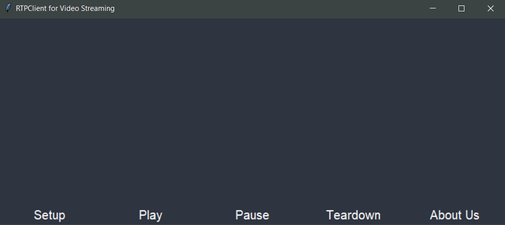

# Assignment for Computer Networks Lab

Assignment 1: Video streaming server

First run the server:

`python Server.py 4200`

The run the video player:

`python ClientLauncher.py 192.168.100.174 4200 5000 movie.Mjpeg`

And the client will show up

Click Setup, then click Play, and the video will start playing
